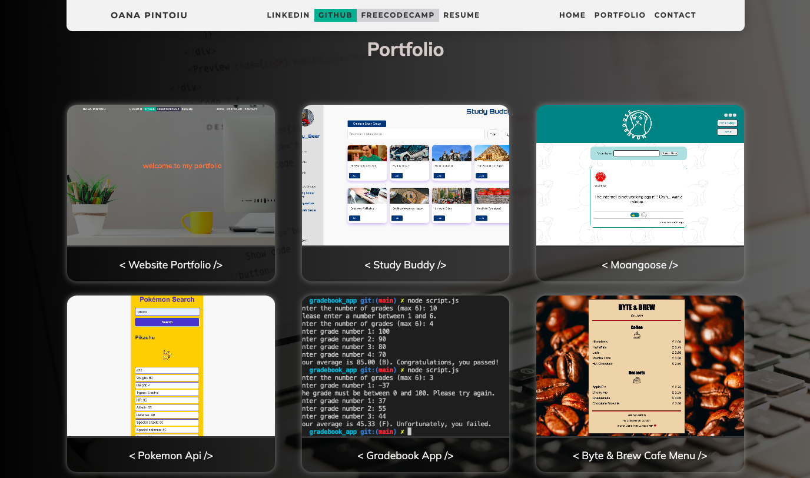
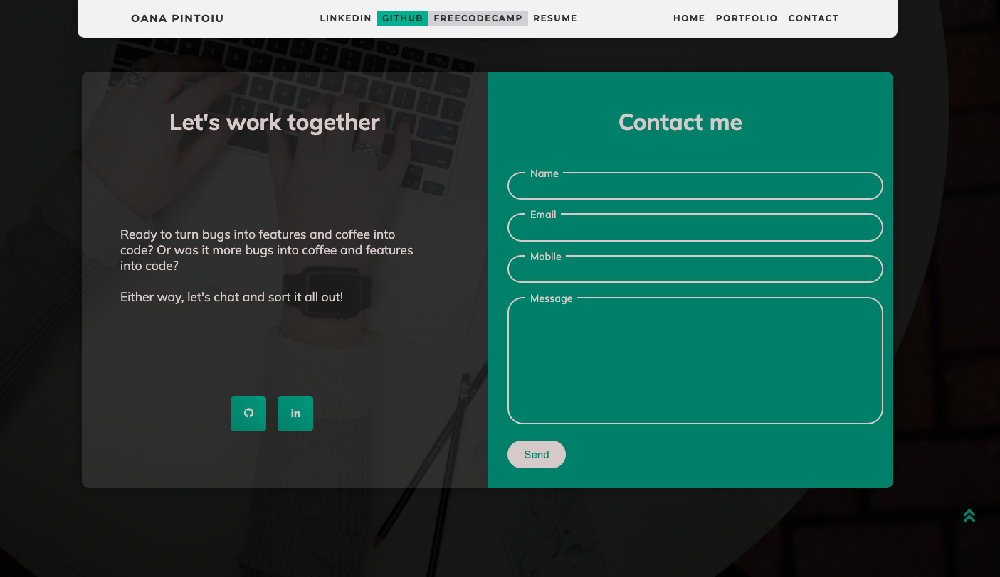

# Oana's Resume Website

This repository contains the source code for my resume website. The website showcases Oana's professional portfolio, including projects, contact information, and links to social media profiles. It is designed to be visually appealing, interactive, and responsive across various devices.

## Table of Contents

[Result](#result) | [Features](#features) | [Sections](#sections) | [Technologies Used](#technologies-used) | [Setup Instructions](#setup-instructions)

## Result

Home Page: 


Projects Section: 



Contact Form:



## Features

- **Responsive Design**: The website is fully responsive and adapts to different screen sizes, ensuring a seamless user experience on desktops, tablets, and mobile devices.
- **Interactive Portfolio**: The portfolio section highlights various projects with descriptions, technologies used, and links to the project repositories.
- **Smooth Scrolling**: Smooth scrolling is implemented for a better navigation experience between different sections of the website.
- **Scroll Animations**: Elements such as navbar, portfolio and contact form items are animated when they come into view, providing a dynamic feel.
- **Social Media Integration**: The website includes links to my personal LinkedIn and GitHub and freeCodeCamp profiles.
- **Contact Form**: A contact form allows visitors to send messages directly through the website.

## Sections

### Navbar

- Includes links to LinkedIn, GitHub, freeCodeCamp, and resume.
- Navigation links for Home, Portfolio, and Contact sections.
- Social media icons for quick access to profiles.

### Home

- An animated welcome text and a scroll down a button leading to the portfolio section.

### Portfolio

- Displays various projects with images, descriptions, technologies used, and links to live demos and GitHub repositories.

### Contact

- Includes a section with a brief message encouraging collaboration.
- A contact form where visitors can submit their name, email, mobile number, and a message.
- Scroll up button leading back to the home page.

## Technologies Used

- **HTML**: Structure of the webpage.
- **CSS**: Styling of the webpage, including responsive design and animations.
- **JavaScript**: Interactivity, such as smooth scrolling, menu toggling, and animations.
- **Node.js**: Used for backend operations (e.g., form submission handling).

### External Libraries

- **Boxicons**: Icon library for social media icons and other UI elements.
- **Remixicons**: Another icon library used within the website.
- **Google Fonts**: Typography (Montserrat and Mulish fonts).

## Setup Instructions

### Clone the Repository:

```
git clone https://github.com/oanapintoiu/Oana_CV_website.git
cd Oana_CV_website
```

### Open the Project

- Open `index.html` in your preferred browser to view the website locally.
